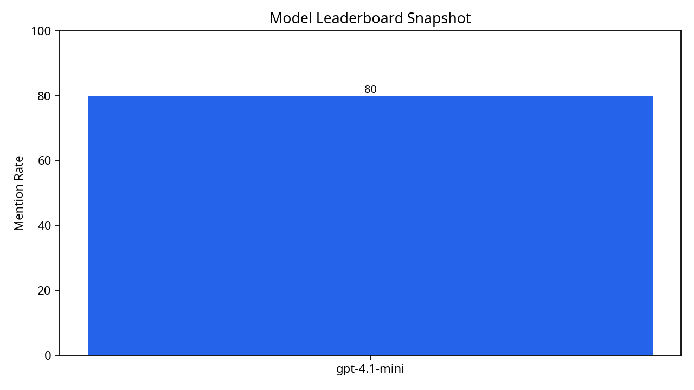
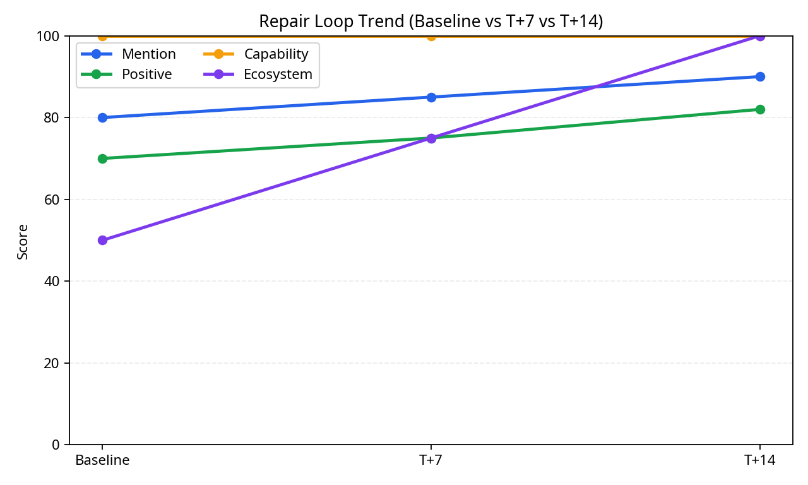

# DevTool Answer Monitor

> 在用户安装你的 developer tool 之前，先看清 LLM 到底怎么描述你。

[](https://github.com/veeicwgy/devtool-answer-monitor/actions/workflows/ci.yml)


[English](README.md) · [简体中文](README.zh-CN.md)

[查看 demo 源文件](docs/index.html) · [MinerU 公开 benchmark](benchmark/mineru-public-benchmark.md) · [Sciverse API 公开 benchmark](benchmark/sciverse-api-public-benchmark.md)

<p align="center">
  
  
  
</p>

**DevTool Answer Monitor** 是一个面向 developer tools、API、SDK 与 open-source 项目的可复现 **答案监控与修复工作流**。
它把 **Query Pool 设计、答案监控、四指标打分、repair loop、activation 分析与 T+7/T+14 回归验证** 串成一套真正可执行的系统，而不是停留在概念层。

## 为什么值得 star

- 仓库自带 **零安装静态 viewer**，不需要先跑脚本就能理解最终产物会长什么样。
- 仓库直接放出 **MinerU / Sciverse API 的公开 benchmark**，不是抽象叙事，也不是只给截图。
- 它强调的是 **修复前 -> T+7 -> T+14** 的版本化证据链，适合团队复盘与长期跟踪。

> 如果你想持续关注 developer-tool answer monitoring、公开 benchmark、query pool 和修复样例，可以先 star。后续更新会优先落在这里。

## 零安装 Demo

仓库已经包含 `docs/` 下的零安装静态 viewer。

- 当前线上状态：等待 GitHub Pages 权限开通
- Viewer 源文件：[`docs/index.html`](docs/index.html)、[`docs/demo.js`](docs/demo.js)、[`docs/data/demo-metrics.json`](docs/data/demo-metrics.json)
- 它会展示什么：MinerU baseline / T+7 / T+14、Sciverse API funnel-stage 切片、top repair candidates、阶段差异
- 正式发布后不需要：API key、依赖安装、本地环境

## 公开 benchmark / case study

- [MinerU 公开 benchmark](benchmark/mineru-public-benchmark.md)：包含 baseline、T+7、T+14 的修复改进故事
- [Sciverse API 公开 benchmark](benchmark/sciverse-api-public-benchmark.md)：面向 scientific API / agent workflow 的公开快照

## 30 秒开始路径

如果你在看完截图后想马上本地跑通，可以按下面顺序执行。

```bash
git clone https://github.com/veeicwgy/devtool-answer-monitor.git
cd devtool-answer-monitor
bash install.sh
make doctor
bash quickstart.sh
```

## 第一次会先看到什么

| 输出 | 路径 | 为什么重要 |
|---|---|---|
| 原始回答 | `data/runs/quickstart-run/raw_responses.jsonl` | 查看多模型原始回答证据 |
| 打分草稿 | `data/runs/quickstart-run/score_draft.jsonl` | 进入人工复核与补标流程 |
| 周报快照 | `data/runs/sample-run/weekly_report.md` | 直接理解团队可消费的周报形态 |
| MinerU 修复链路 | `data/runs/repair-t7-run/summary.json` 和 `data/runs/repair-t14-run/summary.json` | 看 versioned before/after 故事 |
| Sciverse 样例摘要 | `data/runs/sciverse-sample-run/summary.json` | 查看 scientific API 场景下的 funnel-stage 切片 |
| 排行榜快照 | `assets/leaderboard-sample.png` | 快速理解默认多模型对比 |
| 修复趋势快照 | `assets/repair-trend-sample.png` | 观察回归验证的趋势变化 |

> `quickstart.sh` 会生成一个新的 `quickstart-run`，然后复用仓库内置样例摘要，产出报告与图表快照。

## 按目标选择入口

| 目标 | 从哪里开始 | 为什么 |
|---|---|---|
| 提高模型提及和推荐质量 | `data/query-pools/mineru-example.json` + `docs/metric-definition.md` | 先把 4 个核心指标跑通 |
| 提高下载和安装 | `docs/activation-metrics.md` + `playbooks/developer-tool-surface-priority.md` | 把“提及”延伸到“下一步能不能执行” |
| 提高 API 调用和 agent 调用 | `playbooks/agent-readiness.md` + `data/query-pools/sciverse-api-integration-example.json` | 优先修最影响接入和 tool selection 的 query |
| 面向 MinerU / Sciverse / scientific discovery | `playbooks/scientific-product-visibility.md` | 直接使用 scientific product 框架 |

## 应该选哪种模式

| 你的状态 | 推荐模式 | 入口 |
|---|---|---|
| 没有 API key，只想先看完整流程 | Quickstart replay | `bash quickstart.sh` |
| 已经从外部聊天产品拿到回答，想导入评估 | Manual paste mode | `python -m devtool_answer_monitor run --manual-responses ...` |
| 想做真实、持续、多模型监控 | API collection mode | `python -m devtool_answer_monitor run --query-pool ... --model-config ...` |

## 核心命令

| 命令 | 作用 |
|---|---|
| `bash install.sh` | 创建 `.venv` 并安装依赖 |
| `make doctor` | 检查 Python、依赖、样例文件与输出目录是否可用 |
| `bash quickstart.sh` | 运行零 API 成本的新手演示 |
| `make demo-data` | 重建零安装 viewer 所需数据 |
| `make sample-report` | 重建 MinerU 样例报告与图表 |
| `make sample-report-sciverse` | 重建 Sciverse API 样例周报 |
| `make sample-reports` | 重建两套默认样例 |
| `python -m devtool_answer_monitor run ...` | 运行自定义 Query Pool 监控 |

> 兼容说明：`python -m ai_visibility` 和 `python -m geo_monitor` 仍然保留，方便兼容旧自动化。

## 默认样例输入

| 文件 | 用途 |
|---|---|
| `data/query-pools/mineru-example.json` | 面向 developer tools 的默认 Query Pool 样例 |
| `data/query-pools/sciverse-api-integration-example.json` | 面向 scientific API / agent workflow 的 Query Pool 样例 |
| `data/models.sample.json` | 最小单模型配置 |
| `data/models.multi.sample.json` | 默认多模型配置 |
| `data/manual.sample.json` | 最小手工回答样例 |
| `data/manual.multi.sample.json` | 多模型手工回答样例 |
| `data/runs/sample-run/summary.json` | MinerU baseline 样例摘要 |
| `data/runs/repair-t7-run/summary.json` | MinerU T+7 修复样例摘要 |
| `data/runs/repair-t14-run/summary.json` | MinerU T+14 修复样例摘要 |
| `data/runs/sciverse-sample-run/summary.json` | 完整 Sciverse API 样例摘要 |

## 文档索引

- 5 分钟上手：[`docs/for-beginners.md`](docs/for-beginners.md)
- 长版入门：[`docs/getting-started.md`](docs/getting-started.md)
- 指标定义：[`docs/metric-definition.md`](docs/metric-definition.md)
- Activation 指标：[`docs/activation-metrics.md`](docs/activation-metrics.md)
- Agent readiness：[`playbooks/agent-readiness.md`](playbooks/agent-readiness.md)
- Developer-tool surface priority：[`playbooks/developer-tool-surface-priority.md`](playbooks/developer-tool-surface-priority.md)
- Scientific product visibility：[`playbooks/scientific-product-visibility.md`](playbooks/scientific-product-visibility.md)
- Benchmark 索引：[`benchmark/README.md`](benchmark/README.md)
- MinerU 示例案例：[`examples/mineru-case-study.md`](examples/mineru-case-study.md)

## 仓库定位

请把它理解为：

> **面向 developer tools 的答案可观测性工作流**
>
> 它关注的是 **monitoring、scoring、repair、activation 与 regression**，而不是泛化营销文案生成。

## 参与贡献

欢迎贡献。

尤其欢迎这几类改动：

- 新的 query-pool 样例
- benchmark / case study
- sample-run viewer 改进
- runner 改进
- 报告与可视化改进
- schema 与校验改进
- 文档与 onboarding 修订

详情见 [`CONTRIBUTING.md`](CONTRIBUTING.md)。

## License

MIT
